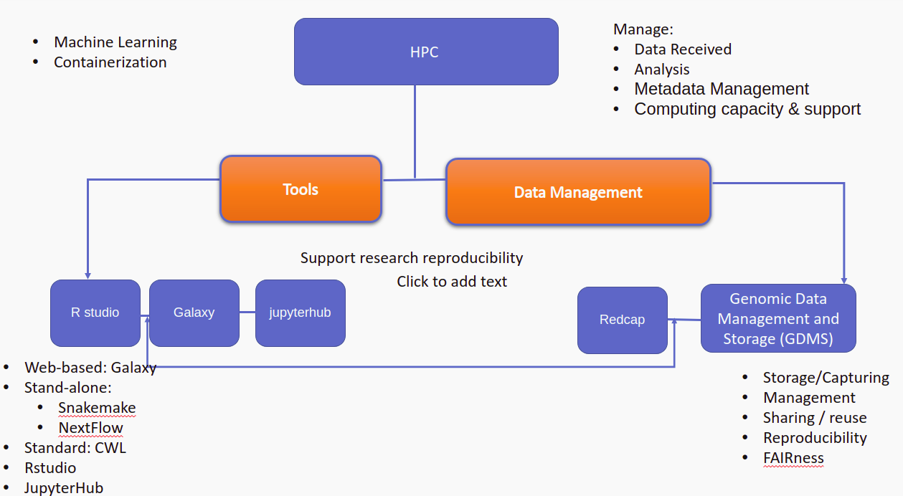

# Icipe-computing

Web interface for Tools offered at ICIPE COMPUTING RESERACH 

For a full list of software, including build and usage instructions, see the [user guide](http://hpc02.icipe.org/) on ICIPE's HPC wiki.

# Access services [HPC](http://hpc01.icipe.org/hpc/)

### Workflow Design

# Running Workflows in the cloud

Icipe allows users to run their workloads on AWS cloud 

# Templates and documentation 
 [running parallel cluster](https://github.com/espirado/Icipe-computing-Research/tree/main/Aws-Cluster)
